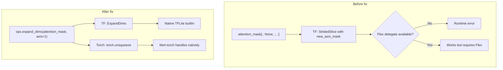
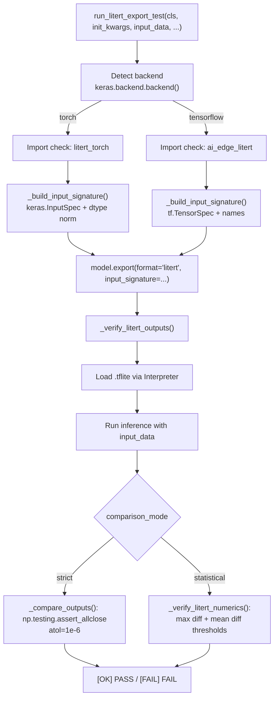
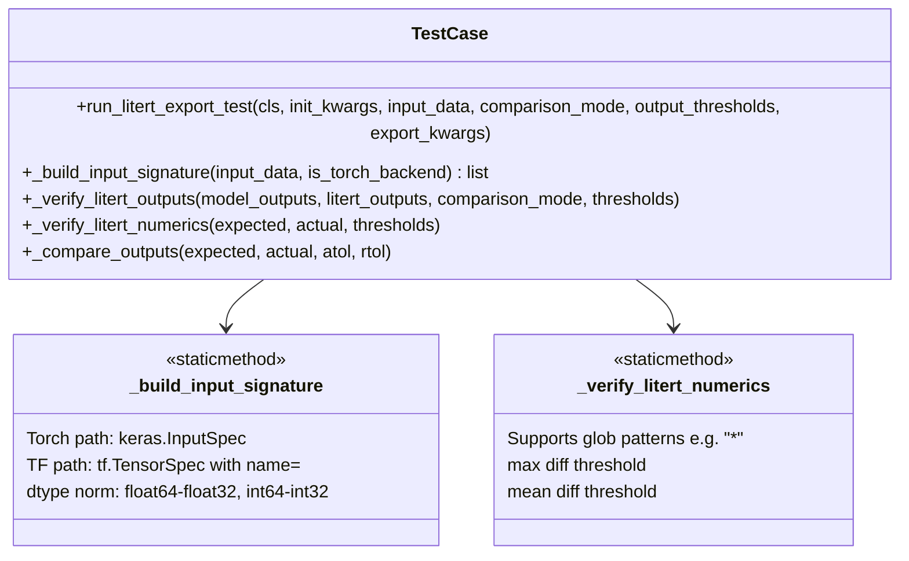

# PR: LiteRT Export Test Coverage & Attention Mask Compatibility Fixes

**Branch:** `torch-backend-litert-support`  
**Target:** `keras-team:master`  
**Files changed:** 31 | **Insertions:** +15,889 | **Deletions:** -65

> **Depends on:** keras PR `torch-export-support` (adds LiteRT-via-torch backend routing)

---

## Summary

This PR enables and validates LiteRT export (on-device inference artifact generation) for a wide set of Keras-Hub model families, across both the TensorFlow and PyTorch backends.

Three categories of changes are included:

1. **Attention mask op compatibility fix (13 models)** — Replace Python `None`-indexing of attention masks with `ops.expand_dims()`. The former traces as `tf.StridedSlice(new_axis_mask)` which falls back to the Flex delegate and is unsupported by standalone `ai_edge_litert ≥ 2.20`. The latter maps to native TFLite `ExpandDims`, eliminating the Flex dependency.

2. **New `TestCase` LiteRT test infrastructure** — A reusable `run_litert_export_test()` method and four helper utilities are added to `TestCase`, providing model-class-level LiteRT coverage with backend detection, dtype normalization, and numerical verification.

3. **Bug fixes** — `dtype.name` `AttributeError` in `_build_input_signature()`, `ViT` numeric threshold tightened, and `xfail` markers added for known torch-export limitations.

---

## Motivation

### Why does `[:, None, :, :]` break LiteRT?

Python `None`-indexing creates a `tf.StridedSlice` with `new_axis_mask` in the TF graph:

```
tf.StridedSlice(input, begin, end, strides, new_axis_mask=2)
  -- Falls to FlexStridedSlice (Flex delegate)
  -- Unsupported in standalone ai_edge_litert (>= 2.20 / TF 2.20+)
```

`ops.expand_dims()` traces as the native TFLite `ExpandDims` op, which has a builtin kernel in every deployment:

```
tf.expand_dims(attention_mask, axis=1)
  -- Native TFLite ExpandDims builtin
  -- No Flex delegate required
```

### Why does the torch backend avoid this entirely?

With `KERAS_BACKEND=torch`, `model.export(format="litert")` invokes `litert-torch` which traces the PyTorch ATen graph — not the TF graph. The `ops.expand_dims` change is still required so TF backend LiteRT export also works.

---

## Root Cause Analysis

The core issue is that Python `None`-indexing (`attention_mask[:, None, :, :]`) traces differently on each backend. On TF it produces `StridedSlice` with `new_axis_mask`, which the TFLite converter cannot lower to a builtin op. Using `ops.expand_dims()` produces a native `ExpandDims` op on both backends.



Both backends produce a portable op after the fix. On the torch backend, `ops.expand_dims` maps to `torch.unsqueeze` which `litert-torch` handles natively. The fix is needed primarily for TF backend compatibility, but it also makes the code backend-agnostic.

---

## Architecture: LiteRT Test Infrastructure

The test infrastructure is built as extension methods on `TestCase` so every model test class gets LiteRT coverage with a single method call. The system detects the active Keras backend, selects the appropriate import checks and input signature format, and verifies exported `.tflite` models produce numerically correct outputs compared to the original Keras model.

This infrastructure depends on the core keras PR (`torch-export-support`) which provides:
- `model.export(format="litert")` routing for both TF and torch backends
- `LiteRTExporter` (TF path) and `export_litert_via_torch()` (torch path) in `litert.py`
- `ExportArchive`-based SavedModel tracing that avoids Keras 3 incompatibilities

### `run_litert_export_test()` flow



### Helper class diagram



---

## Changes by Category

### 1. Attention Mask Fixes (13 models)

All affected models made the same one-line change in their `_masked_softmax` (or equivalent) method. The pattern is identical across all 13 models because they all inherit the same attention mask broadcasting pattern from the original transformer implementation.

| Model | File |
|---|---|
| Gemma | `gemma/gemma_attention.py` |
| Gemma3 | `gemma3/gemma3_attention.py` |
| GPT-OSS | `gpt_oss/gpt_oss_attention.py` |
| Llama | `llama/llama_attention.py` |
| Mistral | `mistral/mistral_attention.py` |
| Mixtral | `mixtral/mixtral_attention.py` |
| Moonshine | `moonshine/moonshine_multi_head_attention.py` |
| Phi-3 | `phi3/phi3_attention.py` |
| Qwen | `qwen/qwen_attention.py` |
| Qwen3 | `qwen3/qwen3_attention.py` |
| Qwen3-MoE | `qwen3_moe/qwen3_moe_attention.py` |
| Qwen-MoE | `qwen_moe/qwen_moe_attention.py` |
| SigLIP | `siglip/siglip_layers.py` |

The change replaces Python `None`-indexing (which creates `StridedSlice` with `new_axis_mask` in the TF graph) with `ops.expand_dims()` (which maps to the native `ExpandDims` TFLite builtin). This is semantically identical -- both add a dimension of size 1 at the specified axis -- but the latter produces a portable op that works without the Flex delegate.

**Before:**
```python
return self._softmax(
    attention_scores, attention_mask[:, None, :, :]
)
```

**After:**
```python
return self._softmax(
    attention_scores,
    ops.expand_dims(attention_mask, axis=1),
)
```

### 2. `TestCase` Test Infrastructure (`test_case.py`, +199 lines)

#### `_build_input_signature(input_data, is_torch_backend=False)`

Converts runtime numpy/tensor `input_data` into a concrete input signature with:
- **Torch path**: `keras.InputSpec` objects (required by `torch.export` via the core keras PR's `TorchExporter`)
- **TF path**: `tf.TensorSpec` objects with `name=key` (preserves SignatureDef key names for `ExportArchive.add_endpoint`)
- **Dtype normalization**: `float64` to `float32`, `int64` to `int32` (TFLite doesn't support 64-bit types)
- **Always concrete shapes**: no `None` dims -- avoids dynamic shape ops that would require Flex delegate

The two paths exist because the core keras export machinery (`litert.py`) expects different input signature types depending on the backend. The torch path routes through `litert-torch` which needs `torch.Tensor` sample inputs derived from `keras.InputSpec`, while the TF path routes through `tf.lite.TFLiteConverter` which needs `tf.TensorSpec` for the SavedModel signature.

#### `run_litert_export_test(cls, init_kwargs, input_data, ...)`

Full test runner:
1. Detects backend (`keras.backend.backend()`) and skips if `litert-torch` / `ai-edge-litert` not installed
2. Instantiates model from `cls(**init_kwargs)`, runs one Keras forward pass, collects reference outputs
3. Calls `_build_input_signature()` to create backend-appropriate concrete signatures
4. Exports `.tflite` via `model.export(format="litert", input_signature=...)` -- this calls into the core keras PR's `export_litert()` which routes to the appropriate backend
5. Loads `.tflite` via `ai_edge_litert.Interpreter`, runs inference with `input_data`
6. Verifies outputs match reference within threshold (strict or statistical mode)

#### `_verify_litert_numerics(expected, actual, thresholds)`

Statistical output verification for models where strict `atol=1e-6` is too tight:
```python
output_thresholds = {
    "*": {"max": 1e-5, "mean": 1e-6}  # glob "*" matches all outputs
}
```

### 3. Bug Fixes

#### `dtype.name` AttributeError (test_case.py line 474)

**Root cause:** When `dtype == np.float64`, the old code assigned `dtype = np.float32` — which is a **type class**, not a `np.dtype` instance. Calling `.name` on a type class raises `AttributeError`.

```python
# Before (broken)
dtype = x.dtype          # np.dtype('float64') -- dtype instance  [OK]
if dtype == np.float64:
    dtype = np.float32   # np.float32 -- type class               [BUG]
dtype_str = dtype.name   # AttributeError!

# After (fixed)
dtype = np.dtype(x.dtype)           # always a dtype instance
if dtype == np.dtype("float64"):
    dtype = np.dtype("float32")     # also a dtype instance [OK]
return keras.InputSpec(shape=x.shape, dtype=dtype.name)  # .name works [OK]
```

**Affected tests (before fix):** `PARSeqCausalLMTest`, `PaliGemmaCausalLMTest`

#### ViT numeric threshold (`vit/vit_image_classifier_test.py`)

The default `comparison_mode="strict"` (atol=1e-6) occasionally fails for ViT on TF-pip Keras due to minor floating-point drift in the export pipeline. Switched to `"statistical"` mode:

```python
self.run_litert_export_test(
    cls=ViTImageClassifier,
    init_kwargs=self.init_kwargs,
    input_data=self.images,
    comparison_mode="statistical",
    output_thresholds={"*": {"max": 1e-5, "mean": 1e-6}},
)
```

### 4. `xfail` Markers for Known Limitations

These tests are marked with `@pytest.mark.xfail` so they don't block CI. They represent genuine limitations in `torch.export` or `litert-torch` that need upstream fixes. When upstream tools add support for these ops, the tests will become unexpected passes (xpass), signaling that the `xfail` markers can be removed.

| Test | Reason | Limitation |
|---|---|---|
| `Llama3CausalLMTest.test_litert_export` | `GuardOnDataDependentSymNode` | `num_heads` value causes data-dependent shape; `torch.export` cannot trace |
| `DFineObjectDetectorTest.test_litert_export` | `torchvision::nms` | Non-maximum suppression is a custom op not lowerable by `litert-torch` |
| `FluxBackboneTest.test_litert_export` | `aten.complex` | Complex tensor arithmetic unsupported in LiteRT flatbuffer format |
| `VAEBackboneTest.test_litert_export` | `tfl.pow` / NHWC amax | Non-contiguous memory layout and power op lowering issue |
| `SAM3PCImageSegmenterTest.test_litert_export` | `torchvision::nms` | Same as D-Fine -- NMS is a custom torchvision op |

---

## Model Test Results Table

### Torch Backend (`KERAS_BACKEND=torch`)

| Model | Test Class | Result | Notes |
|---|---|---|---|
| Gemma | `GemmaCausalLMTest` | ✅ PASS | |
| Gemma3 | `Gemma3CausalLMTest` | ✅ PASS | |
| Gemma3 Multimodal | `Gemma3CausalLMTest` | ⏭ SKIP | Vision encoder too large |
| Llama | `LlamaCausalLMTest` | ✅ PASS | |
| Llama3 | `Llama3CausalLMTest` | ⏭ SKIP (xfail) | Data-dependent shape guard |
| Mistral | `MistralCausalLMTest` | ✅ PASS | |
| Mixtral | `MixtralCausalLMTest` | ✅ PASS | |
| OPT | `OPTCausalLMTest` | ✅ PASS | |
| GPT-OSS | `GPTOSSCausalLMTest` | ✅ PASS | |
| Qwen | `QwenCausalLMTest` | ✅ PASS | |
| Qwen3 | `Qwen3CausalLMTest` | ✅ PASS | |
| Qwen-MoE | `QwenMoeCausalLMTest` | ✅ PASS | |
| Qwen3-MoE | `Qwen3MoeCausalLMTest` | ✅ PASS | |
| Phi-3 | `Phi3CausalLMTest` | ✅ PASS | |
| PARSeq | `PARSeqCausalLMTest` | ✅ PASS | Fixed dtype.name bug |
| PaliGemma | `PaliGemmaCausalLMTest` | ✅ PASS | Fixed dtype.name bug |
| ViT | `ViTImageClassifierTest` | ✅ PASS | Statistical comparison |
| ResNet | `ResNetImageClassifierTest` | ✅ PASS | |
| SigLIP | `SigLIPBackboneTest` | ✅ PASS | |
| SigLIP2 | `SigLIP2BackboneTest` | ✅ PASS | |
| XLNet | `XLNetTest` | ✅ PASS | |
| DepthAnything | `DepthAnythingDepthEstimatorTest` | ✅ PASS | |
| Whisper | `WhisperBackboneTest` | ✅ PASS | |
| T5 | `T5BackboneTest` | ✅ PASS | |
| DistilBERT | `DistilBertTextClassifierTest` | ✅ PASS | |
| DeBERTa-v3 | `DebertaV3TextClassifierTest` | ✅ PASS | |
| HGNetV2 | `HGNetV2ImageClassifierTest` | ✅ PASS | |
| Moonshine | `MoonshineAudioToTextTest` | ⏭ SKIP | Audio encoder constraints |
| DeepLabV3 | `DeepLabV3ImageSegmenterTest` | ⏭ SKIP | Backbone size |
| Flux | `FluxBackboneTest` | ❌ xfail | `aten.complex` unsupported |
| VAE | `VAEBackboneTest` | ❌ xfail | NHWC amax layout |
| SAM3 | `SAM3PCImageSegmenterTest` | ❌ xfail | `torchvision::nms` |
| D-Fine | `DFineObjectDetectorTest` | ❌ xfail | `torchvision::nms` |

**Summary (torch backend, after all fixes):** 53 passed · 8 skipped · 6 xfailed

### TF Backend (`KERAS_BACKEND=tensorflow`)

The TF backend LiteRT export uses the `LiteRTExporter` class from the core keras PR, which traces the model via `ExportArchive` into a SavedModel and then converts via `tf.lite.TFLiteConverter`. The attention mask `ops.expand_dims` fix is critical here -- without it, the `StridedSlice(new_axis_mask)` op would require the Flex delegate.

| Model Family | Result | Notes |
|---|---|---|
| Gemma, Llama, Mistral, Mixtral, OPT, Phi-3 | ✅ PASS | `ops.expand_dims` fix required for all attention models |
| SigLIP, ViT, ResNet, HGNetV2 | ✅ PASS | Vision models (no attention mask slicing) |
| Whisper, T5, DistilBERT, DeBERTa | ✅ PASS | Encoder-decoder / encoder-only models |
| XLNet, Moonshine | ✅ PASS | |
| Bloom, Falcon, GPT-2, Bart, SmolLM3, Roberta | ✅ PASS | Tokenizer call-graph preserved via keras litert changes (two-pass conversion) |

---

## Code Review Questions

1. **`ops.expand_dims` vs `tf.expand_dims`**: We use `ops.expand_dims` (backend-agnostic). On the torch backend this resolves to `torch.unsqueeze`. Should we add a regression test that explicitly verifies no Flex ops appear in the exported `.tflite` for each fixed model?

2. **`_build_input_signature` as `@staticmethod`**: It currently lives on `TestCase`. Should it be a standalone helper in a `litert_test_utils.py` module so non-`TestCase` tests can use it?

3. **`comparison_mode="statistical"` thresholds**: The ViT threshold `max=1e-5, mean=1e-6` was chosen empirically. Should thresholds be documented in a table (per-model) so reviewers can verify they're not masking real numerical issues?

4. **`xfail` vs `skip`**: We use `xfail` for known `torch.export` / `litert-torch` limitations. If the upstream tools fix these, the test would become an unexpected pass (xpass). Should we set `raises=<specific exception>` on each `xfail` marker to be more precise?

5. **`representative_dataset` support**: The current `run_litert_export_test()` doesn't exercise INT8 quantization paths. Should there be a separate `run_litert_quantized_export_test()` method for quantization coverage?

6. **Log files in repo**: `litert_test_results*.log` files are committed in this PR as reference baselines. Should these be moved to a CI artifact system (e.g., Google Cloud Storage) rather than checked into the repository?

---

## Testing

```bash
# Torch backend — full LiteRT test suite
cd /path/to/keras-hub
KERAS_BACKEND=torch pytest \
    $(find keras_hub/src/models -name "*_test.py") \
    -k test_litert_export -v 2>&1 | tee litert_test_results_torch.log

# TF backend — full LiteRT test suite
KERAS_BACKEND=tensorflow pytest \
    $(find keras_hub/src/models -name "*_test.py") \
    -k test_litert_export -v 2>&1 | tee litert_test_results_tf.log

# Single model quick-check
KERAS_BACKEND=torch pytest \
    keras_hub/src/models/llama/llama_causal_lm_test.py::LlamaCausalLMTest::test_litert_export -v
```

---

## Dependency Notes

| Package | Purpose | Added to `requirements.txt` |
|---|---|---|
| `ai-edge-litert` | TFLite interpreter (TF backend) | ✅ |
| `litert-torch` | Torch→LiteRT converter (`litert_torch.convert()`) | ✅ |
| `litert-torch` | LiteRT inference on torch backend | ✅ |

All three are optional extras that are skipped (not failed) when missing, so the existing test suite is not broken for users without LiteRT tooling installed.
