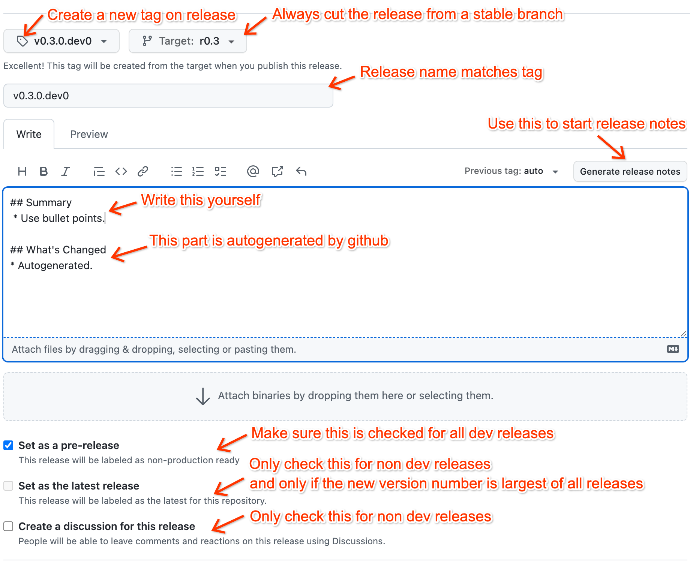

# Release Process

⚠️ This doc is intended for maintainers of the KerasNLP library. Steps below
require push access to base repository. However, all are welcome to use this
process for other projects, or suggest improvements!

## Overview

Our release process consists of two main components:

- Adding a new release to the [keras-nlp](https://pypi.org/project/keras-nlp/)
  project on the Python Package Index (pypi).
- Updating our documentation on [keras.io](https://keras.io/keras_nlp/) to match
  the release.

We follow [semantic versioning](https://semver.org/) for our releases, and
have a different process when releasing major/minor versions (e.g. 1.0 or
1.2) vs a "patch" release (1.0.1). Both are covered below.

## Creating a new major or minor release

Use the following steps to create an `X.Y.0` release.

1. Similar to the Keras and Tensorflow repositories, we keep a named branch
   `rX.Y` for each minor release. We need to set this up.

   From the master branch, create a new branch with a name matching
   the first two digits of the upcoming release. If the git remote for
   `keras-team/keras-nlp` is called `upstream`, this should look as follows:

   ```shell
   git fetch --all
   git checkout --no-track -b rX.Y upstream/master
   git push -u upstream rX.Y
   ```

   This branch will now be used for all subsequent `X.Y.Z` releases.

2. Before we officially push a new stable release to pypi, it is good practice to
   test out a [development release](https://pythonpackaging.info/07-Package-Release.html#Versioning-your-code)
   of the package. Development releases will have version numbers like
   `X.Y.0.dev0`, and critically will never be installed by default by `pip`.

   Make a PR following [this template](https://github.com/keras-team/keras-nlp/pull/456/files)
   to update the our version number fo look like `X.Y.0.dev0`. This PR should
   base off our new release branch. You can use the following commands.

   ```shell
   git fetch --all
   git checkout --no-track -b version-bump-X.Y.0.dev0 upstream/rX.Y
   # Update both setup.py and keras_nlp/__init__.py with an editor.
   git commit -m "Version bump to X.Y.0.dev0"
   git push -u origin version-bump-X.Y.0.dev0
   ```

   On github, make a PR targeting the new release branch, and ask someone to
   review.

3. On github, we can now create the `X.Y.0.dev0` release. Use
   [this link](https://github.com/keras-team/keras-nlp/releases/new) to kick it
   off.

   This release should be titled `X.Y.0.dev0`, and create a new tag with the
   same name on publish. You can use the following screenshot as a reference.

   

   Making a github release will automatically kick off a pypi release, as
   configured by [this file](.github/workflows/publish-to-pypi.yml).

4. Wait a few minutes until the release appears on pypi, then test out the
   release by running `pip install keras-nlp==X.Y.0.dev0`.

   Try to test the package thoroughly! It is a good idea to run through a few
   of our guides with the new version. Fix any bugs you find, and repeat steps
   2 and 3 with a new dev number (e.g. `X.Y.0.dev1`) until you are confident in
   the release.

   It is important that we make any fixes to the master branch first, and
   then cherry-pick them to the release branch. Given a commit hash `e32e9ded`,
   you can cherry pick a change as follows.

   ```shell
   git checkout rX.Y
   # Make sure we are exactly up to date with the upstream branch.
   git fetch --all
   git reset --hard upstream/rX.Y
   # Cherry pick as many times as you need.
   git cherry-pick e32e9ded
   git push upstream rX.Y
   ```

5. We are now ready to cut the official release! Make a PR similar to step 2,
   but updating the release number to `X.Y.0` (no `.dev0` suffix). Land the PR.

   Confirm that the latest commit on our release branch is green before making
   the actual release! We should not release if there are any test failures.

   Make a release similar to step 3, but updating the tag and title to `X.Y.0`.
   Leave "Set as pre-release" unchecked and check the box that says
   "Set as the latest release".

   Click "Publish release" when ready.

6. Now that our release is done, we should bump the version number on our
   master branch. Let `Ŷ = Y + 1`. Our new master branch version should look
   like `X.Ŷ.0`.

   ```shell
   git fetch --all
   git checkout --no-track -b version-bump-X.Ŷ.0 upstream/master
   # Update both setup.py and keras_nlp/__init__.py with an editor.
   git commit -m "Version bump to X.Ŷ.0"
   git push -u origin version-bump-X.Ŷ.0
   ```

   Create a land a PR with this change to the master branch.

7. As a final step, we to update our keras.io documentation to match the
   release.

   The keras.io [README](https://github.com/keras-team/keras-io/)
   contains instructions on building and previewing the site, and you can use
   [this PR](https://github.com/keras-team/keras-io/pull/1134) as a reference
   for what to change. Ask fchollet@ to review.

## Creating a new patch release

Use the following steps to create a "patch" `X.Y.Z` release. We do this when we
do not yet want to release everything on our master branch, but still would like
to push certain fixes out to our users.

1. We need to bring in code changes to the release branch. Whenever possible
   these should be changes also on the master branch, that we cherry pick for
   the release. Given a commit hash `e32e9ded`, you can cherry pick a change
   to the release branch as follows.

   ```shell
   git checkout rX.Y
   # Make sure we are exactly up to date with the upstream branch.
   git fetch --all
   git reset --hard upstream/rX.Y
   # Cherry pick as many times as you need.
   git cherry-pick e32e9ded
   git push upstream rX.Y
   ```

2. Before we officially push a new stable release to pypi, it is good practice to
   test out a [development release](https://pythonpackaging.info/07-Package-Release.html#Versioning-your-code)
   of the package. Development releases will have version numbers like
   `X.Y.Z.dev0`, and critically will never be installed by default by `pip`.

   Make a PR following [this template](https://github.com/keras-team/keras-nlp/pull/456/files)
   to update the our version number fo look like `X.Y.Z.dev0`. This PR should
   base off our new release branch. You can use the following commands.

   ```shell
   git fetch --all
   git checkout --no-track -b version-bump-X.Y.Z.dev0 upstream/rX.Y
   # Update both setup.py and keras_nlp/__init__.py with an editor.
   git commit -m "Version bump to X.Y.Z.dev0"
   git push -u origin version-bump-X.Y.Z.dev0
   ```

   On github, make a PR from your fork to the new release branch, and ask
   someone to review.

3. On github, we can now create the `X.Y.Z.dev0` release. Use
   [this link](https://github.com/keras-team/keras-nlp/releases/new).

   This release should be titled `X.Y.Z.dev0`, and create a new tag with the
   same name on publish. Refer to the screenshot above for details on the
   github release page setup.

   Making a github release will automatically kick off a pypi release, as
   configured by [this file](.github/workflows/publish-to-pypi.yml).

4. Wait a few minutes until the release appears on pypi, then test out the
   release by running `pip install keras-nlp==X.Y.Z.dev0`.

   Try to test the package thoroughly! It is a good idea to run through a few
   of our guides with the new version. Fix any bugs you find, and repeat steps
   2 and 3 with a new dev number (e.g. `X.Y.Z.dev1`) until you are confident in
   the release.

5. We are now ready to cut the official release! Make a PR similar to step 2,
   but updating the release number to `X.Y.Z` (no `.dev0` suffix). Land the PR.

   Confirm that the latest commit on our release branch is green before making
   the actual release! We should not release if there are any test failures.

   Make a release similar to step 3, but updating the tag and title to `X.Y.Z`.
   Leave "Set as pre-release" unchecked and check the box that says
   "Set as the latest release" if `X.Y` is the latest stable release series.

   Click "Publish release" when ready.

6. As a final step, if `X.Y` is the latest stable release series, we need
   to update our keras.io documentation to match the release.

   The keras.io [README](https://github.com/keras-team/keras-io/)
   contains instructions on building and previewing the site, and you can use
   [this PR](https://github.com/keras-team/keras-io/pull/1134) as a reference
   for what to change. Ask fchollet@ to review.
