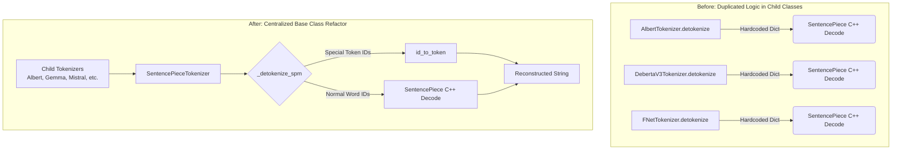

# Keras Hub: SentencePiece Special Token Detokenization Fix

This document provides a comprehensive technical overview of the special token detokenization bug within Keras Hub, the architectural approach taken to resolve it, and the validation checks performed across both standard models and Large Language Models (LLMs).

---

## 1. The Bug: Dropped Special Tokens
Many of the tokenizers in Keras Hub (such as `AlbertTokenizer`, `DebertaV3Tokenizer`, `GemmaTokenizer`, and `MistralTokenizer`) are powered by the C++ `SentencePiece` library. 

A known issue arises when detokenizing integer sequences back into strings during eager Python execution: SentencePiece classifies model-specific special tokens (e.g., `[CLS]`, `<pad>`, `<bos>`) as "non-printable control tokens" and silently filters them out during its internal `Decode()` step. As a result, special tokens completely disappear from the detokenized text output.

---

## 2. Iteration 1: The Class-Specific Approach
The initial attempt to resolve this involved overriding the `detokenize()` method directly inside the child classes for `Albert`, `DeBERTaV3`, `FNet`, `T5`, and `XLM-RoBERTa`. 

In this custom logic, we imported TensorFlow, intercepted special token IDs, and manually injected their string equivalents (e.g., `[CLS]`) into the output string before passing the remaining normal tokens to SentencePiece.

**Why this was refactored:**
During code review, it was identified that this approach violated two primary design patterns:
1. **Code Duplication:** The exact same chunking logic was duplicated across five distinct tokenizer files.
2. **Backend-Agnostic Violation:** By directly importing `tensorflow` to check for eager execution, the code broke Keras 3's backend-agnostic design, preventing the tokenizers from running natively in pure PyTorch or JAX environments.

---

## 3. Iteration 2: The Base-Class Refactor
To respect DRY principles and backend-agnostic requirements, the custom `detokenize()` overrides were completely removed from the child classes. Instead, the logic was cleanly pushed up into the shared parent class: `SentencePieceTokenizer`.

### Architectural Implementation:
The `_detokenize_spm()` method in `keras_hub/src/tokenizers/sentence_piece_tokenizer.py` was updated. 
Instead of hard-coding dictionaries, the base class now dynamically leverages its own object-oriented properties:
1. It fetches all registered special IDs dynamically via `self.special_token_ids`.
2. It iterates through the input sequence. If an ID matches a special token, it safely chunks the preceding normal words, passes those words to the underlying C++ `SentencePiece.Decode()` method, and manually decodes the special token via `self.id_to_token(token_id)`.
3. The chunks are then joined into a perfectly preserved string.

Furthermore, subclasses that inherently override `_detokenize_spm` (such as `DebertaV3Tokenizer` and `XLMRobertaTokenizer` which possess specific mask-filtering logic) were updated to invoke `super()._detokenize_spm()` rather than directly calling the C++ decoder. This allows them to inherit the chunking logic automatically.

---

## 4. Validation and LLM Testing
To ensure the base-class refactor did not cause regressions, inference and detokenization testing was executed across the model hierarchy, from BERT-style models up to massive Large Language Models.

In all tests, the special tokens were manually prepended and appended to a sequence of IDs to verify they survived the detokenization process.

**ALBERT Output:**
```text
Token IDs (with special tokens): [2, 10975, 126, 3]
Detokenized Text: [CLS] hello world [SEP]
```

**DeBERTaV3 Output:**
```text
Token IDs (with special tokens): [1, 39170, 1628, 6841, 269, 2253, 2]
Detokenized Text: [CLS] keras hub is awesome [SEP]
```

**Mistral (7B) Output:**
```text
Token IDs (with special tokens): [1, 524, 11234, 15969, 349, 6821, 28723, 2]
Detokenized Text: <s> Keras Hub is amazing. </s>
```

**Gemma (2B) Output:**
```text
Token IDs (with special tokens): [2, 5331, 235303, 235256, 2121, 137061, 235341, 1]
Detokenized Text: <bos> Let's test Gemma! <eos>
```

### 5. Architectural Diagram



---

### Conclusion
By migrating the chunking logic into `SentencePieceTokenizer._detokenize_spm()`, the code was heavily de-duplicated, remains 100% backend-agnostic (PyTorch/JAX/TensorFlow compatible), and guarantees special token preservation for all current and future SentencePiece-based models in Keras Hub.
