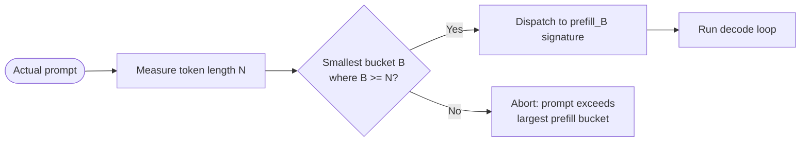
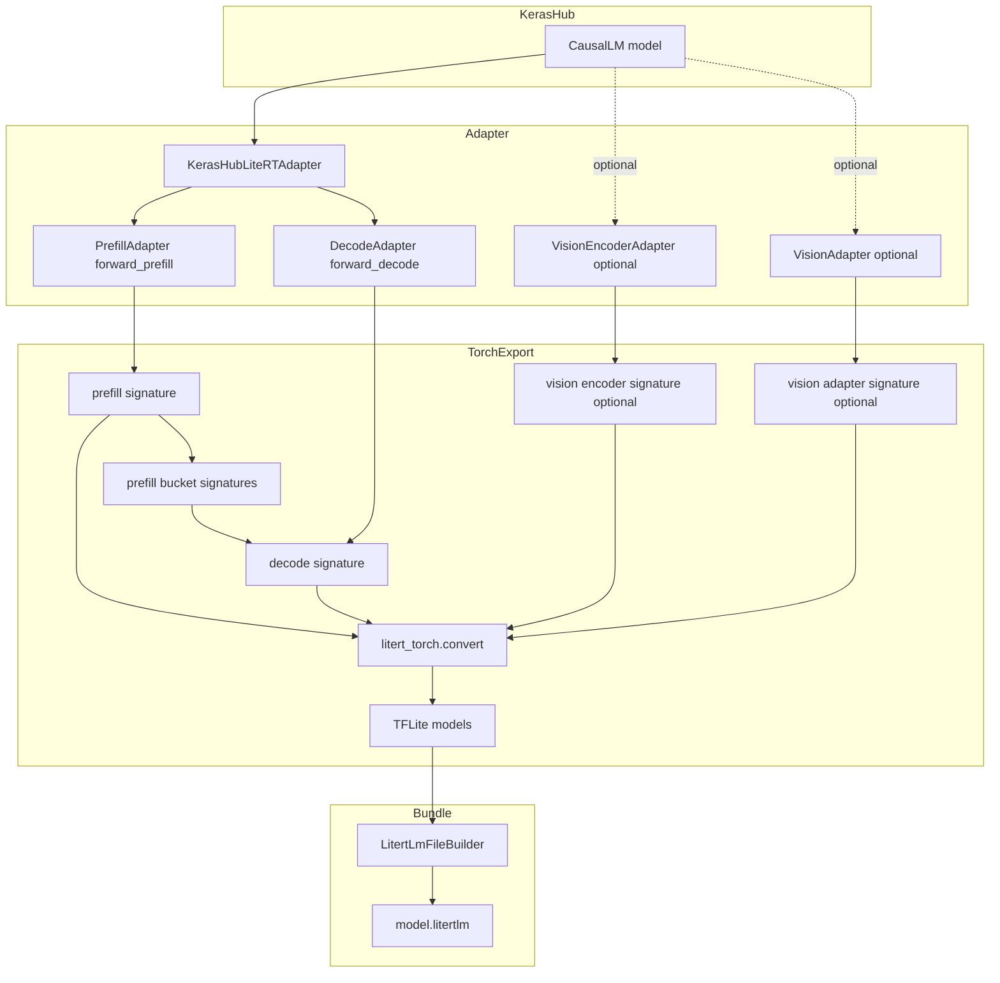
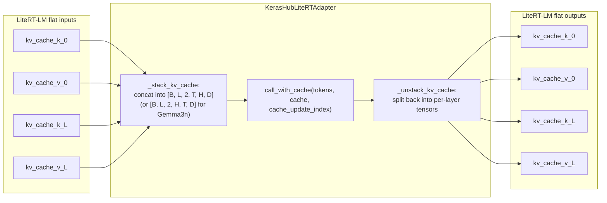
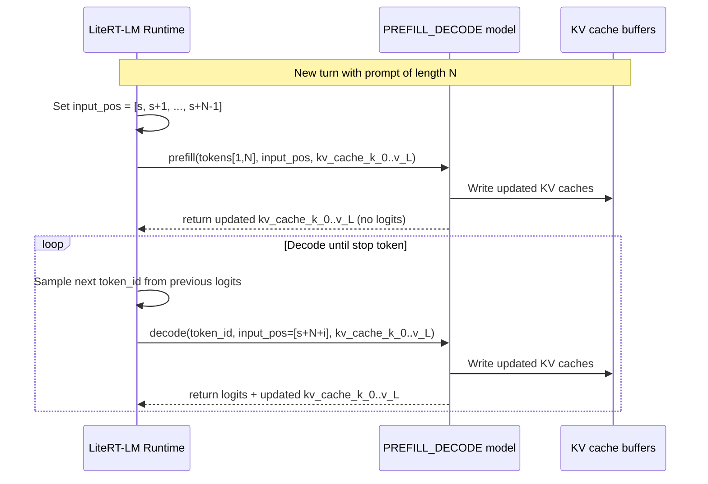
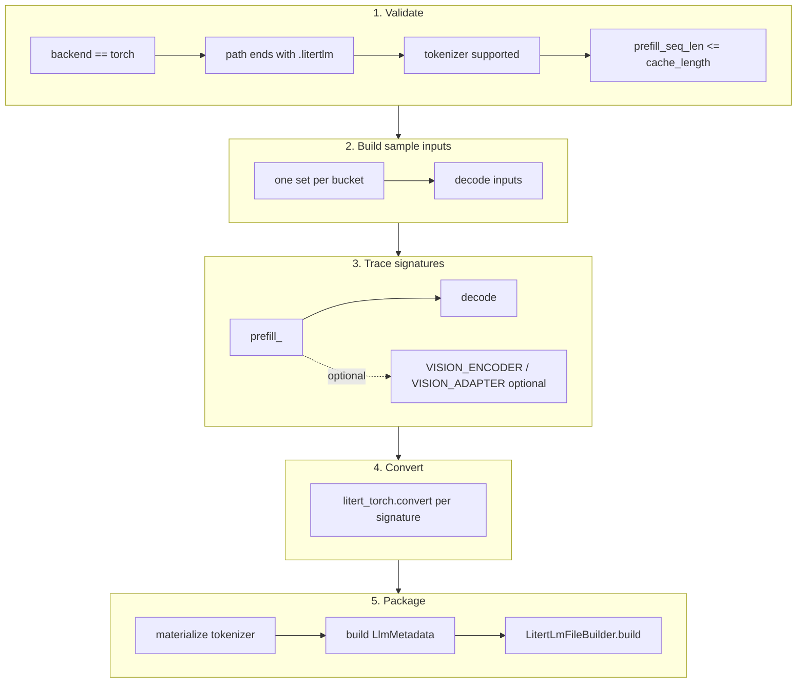
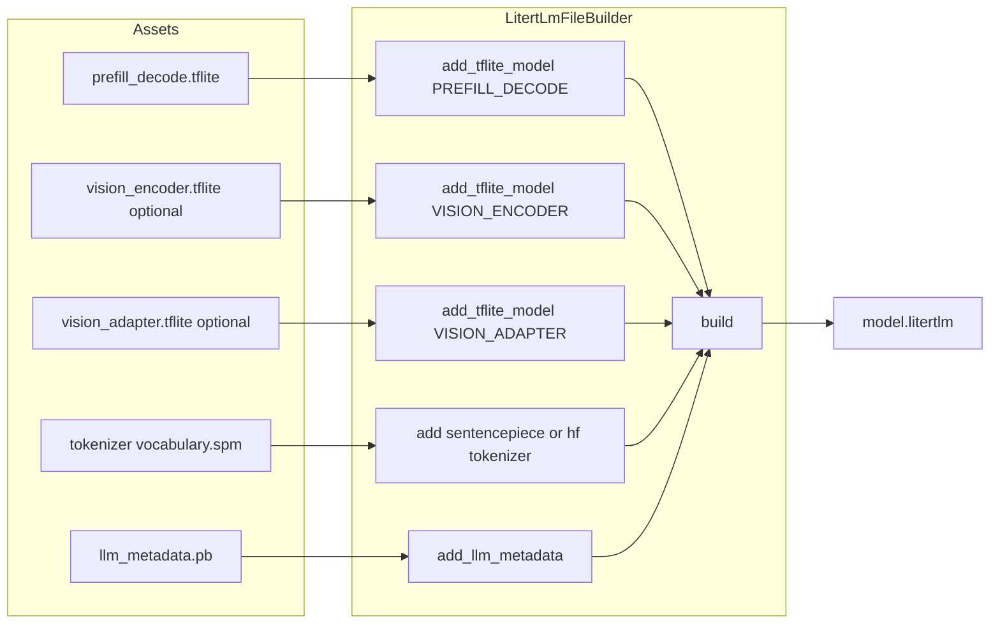
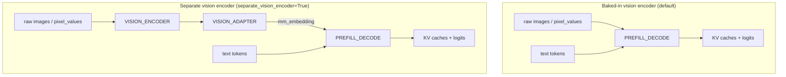
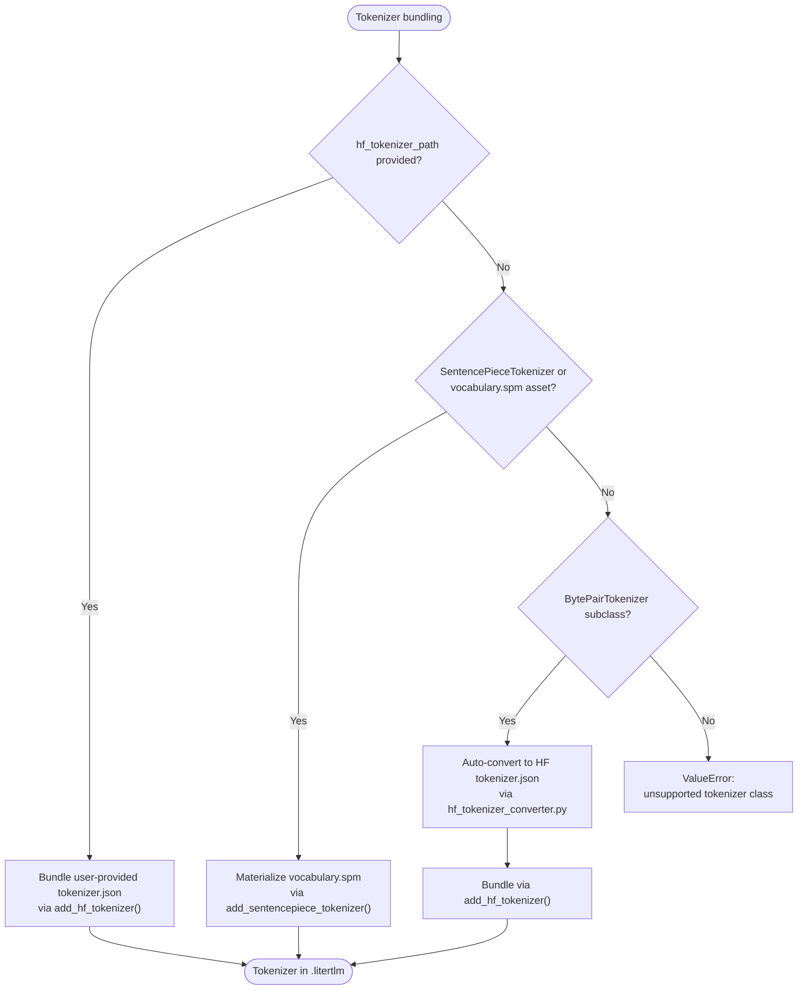
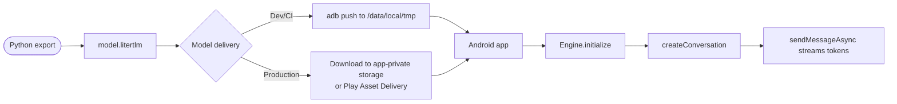

# Design Doc: KerasHub → LiteRT-LM Export

## Contents

1. [At a Glance](#1-at-a-glance)
2. [Goal](#2-goal)
3. [When to Use This](#3-when-to-use-this)
4. [Quick Start](#4-quick-start)
5. [Background & Terminology](#5-background--terminology)
6. [User-Facing API](#6-user-facing-api)
7. [Architecture](#7-architecture)
8. [Multimodal Design](#8-multimodal-design)
9. [Quantization Strategy](#9-quantization-strategy)
10. [Supported & Unsupported Models](#10-supported--unsupported-models)
11. [Key Design Decisions](#11-key-design-decisions)
12. [Alternatives Considered](#12-alternatives-considered)
13. [Limitations](#13-limitations)
14. [Future Work](#14-future-work)
15. [Deployment Notes](#15-deployment-notes)
16. [Appendix: File Layout & Class Glossary](#16-appendix-file-layout--class-glossary)

---

## 1. At a Glance

KerasHub can export `CausalLM` models directly to a `.litertlm` Task Bundle:

```python
model = keras_hub.models.Gemma3CausalLM.from_preset("gemma3_1b")
model.export("model.litertlm", format="litertlm", prefill_seq_len=128)
```

The bundle contains the TFLite inference graph, tokenizer assets, and metadata
that the LiteRT-LM on-device runtime needs to run text generation on Android or
iOS without per-model native inference code.

---

## 2. Goal

Enable `CausalLM.export(filepath, format="litertlm")` to produce a complete
`.litertlm` Task Bundle that the LiteRT-LM runtime can load and execute. The
exporter covers text-only CausalLM models and multimodal models that combine
vision and/or audio with text, including Gemma3, Gemma3n, Gemma4, and
PaliGemma.

---

## 3. When to Use This

This exporter is a good fit when:

- You have a KerasHub `CausalLM` model.
- Your target runtime is LiteRT-LM on Android or iOS.
- You can use the **PyTorch** Keras backend for export.
- You can test on a physical **ARM64** device (emulators are not supported).

It is not a good fit for:

- Non-transformer architectures such as RWKV.
- Models that must stay on the JAX or TensorFlow Keras backend at export time.
- Workflows that require a custom chat template string on device.

---

## 4. Quick Start

### 4.1 Python Export

```python
import keras_hub

model = keras_hub.models.Gemma3CausalLM.from_preset("gemma3_1b")
model.export(
    "model.litertlm",
    format="litertlm",
    prefill_seq_len=[32, 64, 128],
)
```

### 4.2 Android Runtime

```kotlin
val engine = Engine(EngineConfig(modelPath, backend = Backend.CPU()))
engine.initialize()
val conversation = engine.createConversation()
conversation.sendMessageAsync("Hello").collect { print(it) }
```

The [Deployment Notes](#15-deployment-notes) section covers Gradle setup, model
delivery, and backend configuration.

---

## 5. Background & Terminology

Keras already supports `model.export(format="litert")`, which produces a raw
`.tflite` inference graph with a single `serving_default` signature. Turning that
into an on-device LLM experience still requires native code for TFLite
interpreter loading, KV-cache allocation and indexing, tokenizer bundling and
invocation, prefill/decode splitting, sampling, and stop-token detection.

The `.litertlm` Task Bundle format encapsulates all of the above. This design
doc describes the KerasHub exporter that produces that bundle.

### 5.1 Terminology

- **LiteRT-LM** — the on-device LLM runtime and its Android/iOS APIs.
- **`.litertlm`** — the LiteRT-LM Task Bundle file format produced by this
  exporter.
- **`format="litertlm"`** — the export format keyword passed to
  `CausalLM.export()`.
- **`litert-torch`** — the Python package used to trace PyTorch models and
  convert them to TFLite.
- **`litert-lm-builder`** — the Python package used to package TFLite models,
  tokenizer assets, and metadata into a `.litertlm` file.
- **Bucketing** — tracing multiple fixed prefill lengths so the runtime can
  dispatch to the smallest signature that fits the prompt.
- **Backend constraint** — a hint passed to the LiteRT-LM runtime that restricts
  a TFLite model to CPU, GPU, NPU, or a specific GPU variant.
- **AUX model** — an upstream LiteRT-LM pattern that moves KV-cache management
  into a separate auxiliary graph to reduce tensor-binding overhead.

---

## 6. User-Facing API

### 6.1 `CausalLM.export()` for `format="litertlm"`

```python
model.export(
    "model.litertlm",
    format="litertlm",
    prefill_seq_len=128,
    backend_constraint="cpu",
    quant_config=quant_config,
    separate_vision_encoder=False,
    hf_tokenizer_path="/path/to/tokenizer.json",
)
```

Supported kwargs for `format="litertlm"`:

| Kwargs | Type | Description |
|--------|------|-------------|
| `prefill_seq_len` | `int` or `list[int]` | Sequence length(s) used when tracing the prefill signature(s). Defaults to the model's cache length. Each value must be ≤ `cache_length`. |
| `backend_constraint` | optional `str` | `"cpu"`, `"gpu"`, `"npu"`, or `"gpu_artisan"`. Applied to every TFLite model in the bundle. |
| `quant_config` | optional `QuantConfig` | `litert_torch.quantize.quant_config.QuantConfig` for in-conversion quantization. |
| `separate_vision_encoder` | `bool` | If `True` and the model has a vision encoder, export separate `VISION_ENCODER` / `VISION_ADAPTER` TFLite models so the main `PREFILL_DECODE` graph consumes pre-computed embeddings. Defaults to `False`. |
| `hf_tokenizer_path` | optional `str` | Path to a user-provided HuggingFace `tokenizer.json` file. When provided, the exporter skips auto-detection and bundles the file via `add_hf_tokenizer()`. |

Additional `**kwargs` are forwarded to `litert_torch.signature(...)` (e.g.,
advanced tracing options). Unknown kwargs may fail inside `litert_torch` with
less explicit messages, so prefer the documented arguments.

### 6.2 Bucketing

`prefill_seq_len` accepts a single `int` or a `list[int]`. When a list is
provided, the exporter traces one prefill signature per bucket. At runtime the
LiteRT-LM executor dispatches to the smallest bucket that fits the actual
prompt, avoiding wasted computation on padding.

```python
model.export(
    "model.litertlm",
    format="litertlm",
    prefill_seq_len=[32, 64, 128],
)
```

The exporter validates that every requested `prefill_seq_len` is ≤
`cache_length`. Export time scales roughly linearly with the number of buckets
because each bucket is traced as a separate static-shape signature.



At runtime, if a prompt exceeds the largest prefill bucket, the LiteRT-LM
runtime aborts. Developers must size buckets to cover their maximum expected
prompt length; graceful truncation is not yet implemented.

### 6.3 Separate Vision Encoder

```python
model.export(
    "model.litertlm",
    format="litertlm",
    prefill_seq_len=1024,
    separate_vision_encoder=True,
)
```

See the [Multimodal Design](#8-multimodal-design) section for details on when
to use this option.

---

## 7. Architecture

### 7.1 High-Level Flow



### 7.2 The Adapter

KerasHub uses a **stacked KV cache**:
`[batch, num_layers, 2, cache_length, num_kv_heads, head_dim]` and a scalar
`cache_update_index`. LiteRT-LM expects **flat per-layer tensors**:
`kv_cache_k_0`, `kv_cache_v_0`, … and a 1-D `input_pos` tensor.

`KerasHubLiteRTAdapter` (PyTorch `nn.Module`) performs the translation and
supports two cache layouts:

- `"standard"` (default): `[batch, cache_length, num_kv_heads, head_dim]` —
  Gemma3, Llama, Mistral, etc.
- `"gemma3n"`: `[batch, num_kv_heads, cache_length, head_dim]` — Gemma3n.



Export tracing is CPU-only (`_cpu_default_device_scope()` in `adapter.py`
forces the default device to CPU). A module-level lock serializes this change,
so concurrent exports (or exports running alongside GPU work) cannot observe a
partially-applied default device. This keeps the exported graph free of
device-specific constants and makes the bundle portable across CPU/GPU/NPU
runtimes.

The adapter clones the stacked cache before unstacking and clones each per-layer
output tensor. This prevents `torch.export`/`litert_torch` from aliasing
returned KV-cache buffers with activation tensors, which would break the
runtime's assumption of dedicated cache buffers.

The adapter inspects `model.call_with_cache` once and filters kwargs
(`img_embeddings`, `pixel_values`, `vision_mask`, `audio_embeddings`, etc.) to
match the model's actual signature, so the same adapter code works across
text-only, vision-only, and audio models.

**KV cache dtype:** The exported KV cache tensors use the model's compute
dtype. FP32 and FP16 are known to work with the LiteRT-LM runtime; BF16 is
untested and should be converted to FP16 before export for predictable results.

**I/O overhead note:** A 28-layer model produces 56 flat KV-cache input/output
tensors. Binding this many tensors through the TFLite C++ API on every decode
step adds non-zero overhead. The upstream split-cache / AUX model pattern,
described in the [Future Work](#14-future-work) section, reduces this by moving
cache management into a separate graph.

### 7.3 Prefill/Decode Signatures and `input_pos` Semantics



| Signature | Input tokens | `input_pos` | Returns | Purpose |
|-----------|-------------|-------------|---------|---------|
| **prefill** | Full prompt `seq_len = N` | 1-D int32 tensor; first element is the cache start index | Updated KV caches only | Fill the cache with the prompt |
| **decode** | Single token `seq_len = 1` | 1-D int32 tensor of length 1; treated as a scalar cache index | Logits + updated KV caches | Auto-regressive generation |

The runtime calls `prefill` once per turn, then repeatedly calls `decode` until
a stop token is hit.

**Bucketing:** When `prefill_seq_len=[32, 64, 128]` is passed, the exporter
traces prefill signatures (`prefill_32`, `prefill_64`, `prefill_128`) plus one
decode signature. The runtime selects the smallest bucket ≥ the actual prompt
length. Because each signature is a separate static-shape trace, conversion
time scales roughly linearly with the number of buckets.

### 7.4 Export Pipeline

The export pipeline has five phases: validate, build sample inputs, trace
signatures, convert, and package. The main flow runs top-to-bottom; the
sub-steps inside each phase run left-to-right.



A few implementation details worth highlighting:

- **Per-signature conversion.** `litert_torch.convert` runs the full export,
  decomposition, and FX-pass pipeline independently for each signature. Only
  the final flatbuffer merge is shared. This is why adding buckets increases
  export time linearly.

- **Traceability patches.** Keras `ops.slice` converts tensor start-indices to
  Python ints via `.tolist()`, which fails during `torch.export.export` when the
  index is dynamic (e.g. the decode position `input_pos`).
  `_traceable_slice_scope()` (a context manager in `adapter.py`) temporarily
  replaces the Keras torch-backend `slice` implementation with a traceable
  equivalent. Several other traceability scopes (`dot_product_attention`,
  `one_hot`, `repeat`, `arange`, `take`, `scatter_update`) are applied together
  during export and restored in `finally` blocks, so normal eager/training
  behavior is unaffected outside the export window.

- **JAX x64 preservation.** `litert_torch` imports JAX as a side effect and
  enables `jax_enable_x64`. The exporter wraps conversion in
  `_preserve_jax_x64_state()` to restore the original value so dtype-sensitive
  JAX code elsewhere in the same process is not affected.

- **Vision encoder conversion mode.** The optional `VISION_ENCODER` and
  `VISION_ADAPTER` models are converted with `lightweight_conversion=True`,
  while the main `PREFILL_DECODE` model uses `lightweight_conversion=False`.

### 7.5 Bundle Packaging



The bundle contains:

1. **TFLite model(s)**:
   - `PREFILL_DECODE` with `prefill` and `decode` signatures (one `prefill`
     signature per bucket when bucketing is used).
   - Optional `VISION_ENCODER` and `VISION_ADAPTER` models when
     `separate_vision_encoder=True`.
2. **Tokenizer asset** — either a SentencePiece `vocabulary.spm` file for
   supported SentencePiece families, or a HuggingFace `tokenizer.json` for
   BytePair families (auto-converted or user-provided via `hf_tokenizer_path`).
3. **LlmMetadata protobuf** — start/stop tokens, model type, context window,
   vision/audio config.

The `LlmMetadata` protobuf fields are derived as follows:

| Field | Source | Purpose |
|-------|--------|---------|
| `start_token` | `tokenizer.start_token_id` | Token that begins generation |
| `stop_tokens` | `tokenizer.end_token_id` + `<end_of_turn>` (if present) | Tokens that terminate generation |
| `max_num_tokens` | `cache_length` (`backbone.max_sequence_length` → `preprocessor.sequence_length`) | Context window size |
| `llm_model_type` | Model class name → enum | Tells runtime which chat template to apply |
| vision fields (Gemma3) | backbone `image_size` | `image_tensor_height/width`, start/end image tokens |
| vision fields (Gemma4) | backbone `image_size`, encoder `patch_size`/`pool_size` | `patch_width/height`, `max_num_patches`, `pooling_kernel_size` |
| audio start/end tokens | hardcoded `<|audio>` / `<audio|>` for Gemma3n/Gemma4 | Marks audio regions in the prompt |

Model type mapping (lazy `isinstance` checks, then class-name heuristic):

- `Gemma4CausalLM` → `gemma4`
- `Gemma3nCausalLM` → `gemma3n`
- `Gemma3CausalLM` → `gemma3`
- `GemmaCausalLM` → `generic_model`
- `Qwen3CausalLM` → `qwen3`
- `LlamaCausalLM` → `generic_model` (the protobuf does not define a `llama` field)
- `QwenCausalLM` and other Qwen2-family models → `qwen2p5`
- everything else → `generic_model`

This mapping is scoped to the `LlmModelType` values defined by the installed
`litert_lm_builder` runtime proto: `generic_model`, `gemma3n`,
`function_gemma`, `gemma3`, `qwen3`, `qwen2p5`, `gemma4`, and `fast_vlm`.
The exporter does not currently map KerasHub models to `function_gemma` or
`fast_vlm`.

### 7.6 Cache Config Extraction

`export_to_litertlm` derives the following from the model at export time:

| Field | Source | Fallback |
|-------|--------|----------|
| `num_layers` | `backbone.num_layers` | `backbone.num_hidden_layers` |
| `cache_length` | `backbone.max_sequence_length` | `preprocessor.sequence_length` |
| `num_kv_heads` | `backbone.num_key_value_heads` | `backbone.num_query_heads` → `backbone.num_heads` → `backbone.num_attention_heads` |
| `head_dim` | `backbone.head_dim` | `hidden_dim // num_query_heads` (falling back to `num_heads`, then `num_attention_heads`) |
| `dtype` | `model.compute_dtype` / `backbone.compute_dtype` | `float32` |

### 7.7 Heuristics and Extension Points

A few behaviors use class-name / attribute introspection rather than a registry
because the upstream KerasHub model classes do not expose a uniform metadata
protocol:

| Behavior | Current heuristic | How to extend |
|----------|-------------------|---------------|
| KV-cache layout | `type(backbone).__name__.startswith("Gemma3n")` | Add a new branch in `_get_cache_config` (`export.py`) if a future model needs a non-standard layout. |
| LiteRT-LM model type | Lazy `isinstance` mapping, then class-name substring fallback | Add a new `(module, class, model_type)` tuple to `_MODEL_TYPE_MAPPING` in `_detect_llm_model_type` (`export.py`). |
| HF tokenizer conversion | Family-agnostic introspection of `BytePairTokenizer` subclasses in `hf_tokenizer_converter.py` | Add support for a new `BytePairTokenizer` subclass, or extend to non-BytePair tokenizer classes (e.g., WordPiece, Unigram). |
| Vision/audio config | `getattr` chains with documented defaults | Add explicit handling in `_get_vision_config` / `_get_audio_config` (`export.py`). |

A long-term improvement is to add a `litertlm_config()` protocol on `CausalLM`
/ `Backbone` so new models declare these values explicitly instead of relying
on introspection.

---

## 8. Multimodal Design

For multimodal models, the vision/audio encoders are baked into the **prefill**
signature by default, so image/audio inputs are processed alongside text tokens.
The decode signature remains text-only because image/audio KV-caches are
already seeded after prefill.

- **Gemma3-style vision:** raw `images` tensor `[batch, num_images, H, W, 3]`.
- **Gemma4 vision:** pre-processed patches (`pixel_values` +
  `pixel_position_ids`).
- **Audio:** mel-spectrogram (`audio_mel`) + masks/indices; feature dimension
  is read from the preprocessor (`audio_input_feat_size`, default 128). Audio
  inputs are wired in code but end-to-end export is not yet covered by
  automated tests.



`separate_vision_encoder=True` exports the vision encoder as separate
`VISION_ENCODER` / `VISION_ADAPTER` TFLite models. This is supported for
Gemma3, Gemma4, and PaliGemma; it is **not supported** for Gemma3n because the
MobileNetV5 projection lives inside the backbone. In separate-encoder mode the
main `PREFILL_DECODE` graph consumes pre-computed embeddings (`mm_embedding`)
instead of raw images, which reduces bundle size and avoids re-encoding the
same image across turns. Audio-only separation is not yet supported.

PaliGemma's `vit_encoder` accepts only one image per sample (`[B, H, W, 3]`).
The adapter collapses the `[B, N, H, W, 3]` runtime input into `[B*N, H, W, 3]`,
runs the encoder, and returns features with shape
`[B*N, tokens_per_image, dim]`.

For Gemma3n, `pixel_values` and `input_features` are passed straight through to
`call_with_cache` because the vision/audio encoders are part of the backbone
rather than separate modules.

**Bucketing restriction:** Any model with a vision encoder currently requires
`prefill_seq_len == cache_length`; bucketing is unsupported for all vision
models, including `separate_vision_encoder=True`.

---

## 9. Quantization Strategy

### 9.1 In-Conversion Quantization

`CausalLM.export()` accepts an optional `quant_config` keyword argument that is
forwarded directly to `litert_torch.convert()` for in-graph quantization. It
must be an instance of `litert_torch.quantize.quant_config.QuantConfig`.

Supported recipes from `litert_torch.generative.quantize.quant_recipes`:

| Recipe | Parameters | Description |
|--------|------------|-------------|
| `full_dynamic_recipe()` | `mcfg`, `weight_dtype`, `granularity` | Dynamic-range quantization of weights (activations stay FP32). Good first-try default. |
| `full_weight_only_recipe()` | `mcfg`, `weight_dtype`, `granularity` | Weight-only quantization; activations remain FP32. Preferred for size-sensitive deployment after accuracy validation. |
| `full_fp16_recipe()` | `mcfg` only | FP16 weights and activations. Does **not** accept `weight_dtype` or `granularity`; passing them raises an error. |

`weight_dtype`: `INT8` (default), `INT4`, `FP16`, `FP32`.
`granularity`: `CHANNELWISE` (default), `BLOCKWISE_32`, `BLOCKWISE_64`,
`BLOCKWISE_128`, `BLOCKWISE_256`.

```python
from litert_torch.generative.quantize.quant_recipes import full_weight_only_recipe
import litert_torch.generative.quantize.quant_attrs as quant_attrs

model.export(
    "model.litertlm",
    format="litertlm",
    prefill_seq_len=128,
    quant_config=full_weight_only_recipe(
        weight_dtype=quant_attrs.Dtype.INT4,
        granularity=quant_attrs.Granularity.BLOCKWISE_128,
    ),
)
```

### 9.2 Post-Export Quantization

If `quant_config` is omitted, export produces unquantized FP32/FP16. For
deployable sizes:

1. Export to `.litertlm`
2. Extract TFLite from bundle
3. Run `ai-edge-quantizer` (supports INT8, INT4, dynamic/static, weight-only)
4. Repackage with `LitertLmFileBuilder`

**Observed example:** Gemma3 270M goes from ~1.1 GB (FP32) → ~275 MB (INT8
dynamic).

---

## 10. Supported & Unsupported Models

CausalLM models are categorized by tokenizer type and architecture. The exporter
supports native SentencePiece tokenizers, user-provided HuggingFace
`tokenizer.json` files, and auto-conversion for any `BytePairTokenizer`
subclass.

### 10.1 Tokenizer Support Tiers

Tokenizer bundling is not all-or-nothing. The exporter supports three tiers,
each with different runtime guarantees:



1. **Native SentencePiece** — KerasHub `SentencePieceTokenizer` subclasses. The
   exporter materializes a `vocabulary.spm` file and bundles it via
   `add_sentencepiece_tokenizer()`. The LiteRT-LM runtime parses the
   SentencePiece protobuf directly and supports constrained decoding.

2. **User-provided HuggingFace `tokenizer.json`** — A user-provided HF
   `tokenizer.json` file (via `hf_tokenizer_path`) is bundled verbatim via
   `add_hf_tokenizer()`. The `.litertlm` format declares an
   `HF_Tokenizer_Zlib` section, and the LiteRT-LM runtime parses it with the HF
   `tokenizers` crate. This path is functional for ordinary encode/decode
   generation. Runtime constrained decoding is currently SentencePiece-only,
   and streaming loading of an `HF_Tokenizer_Zlib` section is not yet
   implemented.

3. **Auto-converted BytePair → HF `tokenizer.json`** — For any KerasHub
   `BytePairTokenizer` subclass, the exporter converts it to HF
   `tokenizer.json` using `keras_hub/src/utils/litertlm/hf_tokenizer_converter.py`
   and bundles it via `add_hf_tokenizer()`. This inherits the same runtime
   caveats as tier 2.

| Model family | KerasHub tokenizer class | Builder method | Asset |
|--------------|--------------------------|----------------|-------|
| Gemma, Mistral, Phi3, Llama | `SentencePieceTokenizer` | `add_sentencepiece_tokenizer()` | `vocabulary.spm` |
| GPT2, Llama3, Qwen3, Bloom, Falcon, GPT-NeoX, GPT-OSS, OPT, Qwen, Qwen3.5, Qwen-MoE, Qwen3-MoE, SmolLM3 | `BytePairTokenizer` | `add_hf_tokenizer()` | `tokenizer.json` (auto-converted or user-provided) |

A user-provided `hf_tokenizer_path` can override auto-conversion for any
HF-compatible tokenizer.

### 10.2 Supported Model Families

| Model family | Class | Test file | Notes |
|--------------|-------|-----------|-------|
| Gemma | `GemmaCausalLM` | `gemma_causal_lm_test.py` | Text-only baseline |
| Gemma3 | `Gemma3CausalLM` | `gemma3_causal_lm_test.py` | Vision + text; baked-in and separate vision encoder |
| Gemma3n | `Gemma3nCausalLM` | `gemma3n_causal_lm_test.py` | Vision + audio + text; baked-in vision works, separate vision encoder unsupported |
| Gemma4 | `Gemma4CausalLM` | `gemma4_causal_lm_test.py` | Vision + audio + text; baked-in and separate vision encoder |
| GPT2 | `GPT2CausalLM` | `gpt2_causal_lm_test.py` | Auto-converted to HF `tokenizer.json` |
| Llama | `LlamaCausalLM` | `llama_causal_lm_test.py` | Maps to `generic_model` metadata |
| Llama3 | `Llama3CausalLM` | `llama3_causal_lm_test.py` | Auto-converted to HF `tokenizer.json` |
| Mistral | `MistralCausalLM` | `mistral_causal_lm_test.py` | |
| Mixtral | `MixtralCausalLM` | `mixtral_causal_lm_test.py` | MoE text model |
| PaliGemma | `PaliGemmaCausalLM` | `pali_gemma_causal_lm_test.py` | Uses `vit_encoder` (single-image input) |
| Phi3 | `Phi3CausalLM` | `phi3_causal_lm_test.py` | |
| Qwen3 | `Qwen3CausalLM` | `qwen3_causal_lm_test.py` | Auto-converted to HF `tokenizer.json` |
| Bloom | `BloomCausalLM` | `bloom_causal_lm_test.py` | Auto-converted to HF `tokenizer.json` |
| GPT-NeoX | `GPTNeoXCausalLM` | `gpt_neo_x_causal_lm_test.py` | Auto-converted to HF `tokenizer.json` |
| OPT | `OPTCausalLM` | `opt_causal_lm_test.py` | Auto-converted to HF `tokenizer.json` |
| Qwen | `QwenCausalLM` | `qwen_causal_lm_test.py` | Auto-converted to HF `tokenizer.json` |
| Qwen-MoE | `QwenMoeCausalLM` | `qwen_moe_causal_lm_test.py` | Auto-converted to HF `tokenizer.json` |
| Qwen3-MoE | `Qwen3MoeCausalLM` | `qwen3_moe_causal_lm_test.py` | Auto-converted to HF `tokenizer.json` |
| Falcon | `FalconCausalLM` | `falcon_causal_lm_test.py` | Runtime chat template / `LlmModelType` not yet mapped; tokenizer bundles as HF JSON |
| Qwen3.5 | `Qwen3_5CausalLM` | `qwen3_5_causal_lm_test.py` | Runtime chat template / `LlmModelType` not yet mapped; tokenizer bundles as HF JSON |
| SmolLM3 | `SmolLM3CausalLM` | `smollm3_causal_lm_test.py` | Runtime chat template / `LlmModelType` not yet mapped; tokenizer bundles as HF JSON |
| GPT-OSS | `GptOssCausalLM` | `gpt_oss_causal_lm_test.py` | Runtime chat template / `LlmModelType` not yet mapped; tokenizer bundles as HF JSON |

### 10.3 Why HF Tokenizers Are Not Universally First-Class

HF tokenizer support is already partially in place: the file format, the
builder, and the runtime can all consume HuggingFace `tokenizer.json` files.

The remaining gaps are:

1. **Non-BytePair tokenizer classes.** WordPiece, Unigram, and other tokenizer
   families still require a user-provided `hf_tokenizer_path` or a new
   converter.
2. **Runtime gaps for HF tokenizers.** Constrained decoding is currently
   SentencePiece-only, and streaming loading of an `HF_Tokenizer_Zlib` section
   is not yet implemented.

The exporter intentionally **does not** fall back to the lossy BPE →
SentencePiece conversion that upstream tooling offers (~1% token-ID mismatch
reported for Llama3.2). It bundles HF JSON instead, preserving token identity.

### 10.4 Unsupported by the Current Exporter

| Model family | Class | Reason |
|--------------|-------|--------|
| RWKV7 | `RWKV7CausalLM` | Non-transformer recurrent architecture |
| PARSeq | `PARSeqCausalLM` | OCR model, not a generative causal LM |

The exporter fails fast with explicit `ValueError` / `RuntimeError` messages for
unsupported configurations. Notable cases:

| Condition | Exception | Notes |
|-----------|-----------|-------|
| Backend is not PyTorch | `ValueError` | `keras.config.backend() != "torch"` |
| Output path does not end in `.litertlm` | `ValueError` | |
| Model has no `call_with_cache` | `ValueError` | Required for cache-aware generation |
| `litert-torch` / `litert-lm-builder` not installed | `ImportError` at import time / `RuntimeError` at export | Tests skip instead of failing |
| `quant_config` is not a `QuantConfig` | `ValueError` | Must be `litert_torch.quantize.quant_config.QuantConfig` |
| Invalid `backend_constraint` | `ValueError` | Valid: `"cpu"`, `"gpu"`, `"npu"`, `"gpu_artisan"` |
| `hf_tokenizer_path` is not an existing `.json` file | `ValueError` | |
| Unsupported tokenizer class | `ValueError` | Tokenizer is not `SentencePieceTokenizer`, `BytePairTokenizer`, or a user-provided HF `tokenizer.json` |
| `separate_vision_encoder=True` with no vision encoder | `ValueError` | |
| `separate_vision_encoder=True` for Gemma3n | `ValueError` | MobileNetV5 projection is inside the backbone |
| Vision model with bucketing | `ValueError` | `prefill_seq_len` must equal `cache_length` |
| Requested `prefill_seq_len > cache_length` | `ValueError` | Per-bucket validation |
| BF16 compute dtype | untested | FP32 and FP16 are known to work |

Most errors are raised before any heavy tracing begins, so invalid calls fail
quickly.

---

## 11. Key Design Decisions

- **HF JSON over BPE → SentencePiece.** The exporter bundles HuggingFace
  `tokenizer.json` for BytePair families instead of using the lossy BPE →
  SentencePiece conversion available in upstream tooling. This preserves token
  identity (reported ~1% mismatch for Llama3.2) at the cost of narrower runtime
  feature support for HF tokenizers.

- **CPU-only tracing.** The adapter forces the default device to CPU during
  `torch.export.export`. This keeps the exported graph free of device-specific
  constants and makes the same bundle portable to CPU, GPU, and NPU runtimes.

- **Flat KV cache.** The adapter translates KerasHub's stacked KV cache into
  flat per-layer tensors expected by LiteRT-LM. This matches the current
  runtime contract but binds many tensors per decode step; the Future Work
  section describes a path toward a split-cache AUX model.

- **PyTorch backend guard.** Export is supported only when
  `keras.config.backend() == "torch"`. JAX/TensorFlow backends are rejected at
  export time because `litert_torch` consumes PyTorch modules.

- **Quantization integration.** In-conversion quantization is supported by
  forwarding a `litert_torch` `QuantConfig` to `litert_torch.convert()`. A
  post-export quantization workflow is also documented for tools outside the
  exporter.

- **Bucketing is text-only.** Vision models require
  `prefill_seq_len == cache_length` because the vision encoder shapes and
  runtime expectations currently assume a single prefill length. Text models
  can use arbitrary buckets.

- **Separate vision encoder is opt-in.** By default vision/audio encoders are
  baked into the prefill signature, producing a single `PREFILL_DECODE` graph.
  `separate_vision_encoder=True` moves the vision tower into `VISION_ENCODER` /
  `VISION_ADAPTER` sub-models. This reduces graph size and avoids re-encoding
  the same image across turns, but it is unsupported for Gemma3n because the
  MobileNetV5 projection lives inside the backbone.

- **Traceability patches are scoped to export.** The traceability patches
  (`slice`, `dot_product_attention`, `one_hot`, `repeat`, `arange`, `take`,
  `scatter_update`) are applied only inside their context-manager scopes during
  export and restored in `finally` blocks, minimizing the risk of altering
  normal eager or training behavior.

---

## 12. Alternatives Considered

| Alternative | Why Not Sufficient |
|-------------|-------------------|
| Status quo (`format="litert"` only) | Forces developers to hand-write native inference code per model. |
| Export raw TFLite only | Still leaves tokenization, cache management, and chat templating unsolved. |
| Build a Keras-specific mobile SDK | Would fragment the Google AI Edge stack. LiteRT-LM already powers on-device LLMs. |

---

## 13. Limitations

### 13.1 Export-Time

| Limitation | Detail |
|------------|--------|
| PyTorch backend only | `keras.config.backend() == "torch"`. JAX/TensorFlow not supported. |
| Non-SentencePiece tokenizers | Auto-conversion is provided for all `BytePairTokenizer` subclasses. A user-provided `hf_tokenizer_path` can be used for any HF-compatible tokenizer. Lossy BPE → SentencePiece conversion is intentionally avoided. |
| Fixed prefill length per signature | Mitigated by bucketing for text models. All vision models require `prefill_seq_len == cache_length`. |
| Large unquantized bundles | Gemma4 2B is observed to export to **> 20 GB** in FP32 when encoders are baked in. Use `separate_vision_encoder=True` and quantization for practical deployment. |
| Architecture coverage | Standard KV-cache transformers only. RWKV incompatible. |
| BF16 compute dtype | Not validated for LiteRT-LM export; convert to FP16 first. |
| Export time | Conversion time scales roughly linearly with the number of signatures (prefill buckets + decode) and with model depth. Large vocabularies increase constant serialization cost; sequence length has little effect. |

### 13.2 Runtime (LiteRT-LM)

| Limitation | Detail |
|------------|--------|
| Emulator unsupported | Fails on x86_64 emulators. Physical ARM64 devices required. |
| CPU-only validated | `Backend.CPU()` works. GPU/NPU delegates exist but are not validated across models. |
| No APK asset bundling | Models 275 MB–1 GB+ exceed base-module size limits. Must push/download at runtime. |
| Chat template format baked | Developers control content (roles, system prompt, history) but not the template formatting string. Runtime applies it based on `LlmModelType`. |
| First-load latency | Engine initialization compiles the TFLite graph on first run. |
| Over-length prompts | Runtime aborts if no prefill bucket fits; no graceful truncation. |
| HF tokenizer constrained decoding | Runtime constrained decoding is currently SentencePiece-only. |
| HF tokenizer streaming | Streaming loading of an `HF_Tokenizer_Zlib` section is not yet implemented. |

### 13.3 Multimodal

- By default, vision/audio encoders are baked into the prefill signature, so
  the exported bundle contains a single `PREFILL_DECODE` model.
- For Gemma4/PaliGemma-style runtime expectations, `separate_vision_encoder=True`
  exports separate `VISION_ENCODER` / `VISION_ADAPTER` sub-models and has
  `PREFILL_DECODE` consume pre-computed embeddings. This is supported for
  Gemma3, Gemma4, and PaliGemma.
- Gemma3n separate vision encoder export is unsupported because the
  MobileNetV5 projection lives inside the backbone; only baked-in vision export
  is supported.
- Audio remains baked-in because upstream `AUDIO_ENCODER_HW` export is not yet
  available.

---

## 14. Future Work

The following are explicitly out of scope for the current exporter but are
natural next steps:

1. **Arbitrary non-BytePair tokenizer support**: Extend
   `hf_tokenizer_converter.py` to handle tokenizer classes beyond
   `BytePairTokenizer` (e.g., WordPiece, Unigram) while preserving token
   identity.
2. **Close runtime gaps for HF tokenizers**: Enable constrained decoding and
   streaming loading for `HF_Tokenizer_Zlib` sections.
3. **Split cache + externalized embedder**: Adopt upstream `AUX` and
   `EMBEDDER` models once APIs are stable.
4. **Separate audio encoder export**: Blocked on upstream `AUDIO_ENCODER_HW`
   support.
5. **Gemma3n separate vision encoder**: Enable once MobileNetV5 projection can
   be exported independently.
6. **QAT checkpoint handling**: Fail fast when `quant_method=gemma` is
   detected.
7. **GPU/NPU delegate validation**: Currently only `Backend.CPU()` is validated
   end-to-end.
8. **Externalized weight packaging**: Add support for packaging very large
   unquantized models with externalized weight files.
9. **INT4 on-device compatibility**: Investigate CPU-delegate `GATHER_ND`
   failures for INT4 weight-only bundles.
10. **Upstream `litert_torch` pipeline optimizations**: The observed
    multiplicative export cost could be reduced by upstream improvements such
    as a stable JAX-bridge cache key for per-op lowerings, guarded FX-pass
    recompiles, and a cross-signature lowering cache.

---

## 15. Deployment Notes

### 15.1 Android Dependency

Only one runtime library is required:

```kotlin
// build.gradle.kts — verify the artifact version against current LiteRT-LM release notes
dependencies {
    implementation("com.google.ai.edge.litertlm:litertlm-android:<version>")
}
```

`litertlm-android` pulls in the native TFLite runtime, delegates, and JNI
bindings. No Keras, PyTorch, or HuggingFace libraries are needed on the device.

### 15.2 Required build.gradle.kts Settings

```kotlin
android {
    defaultConfig {
        ndk { abiFilters += listOf("arm64-v8a") }
    }
    androidResources { noCompress += listOf("litertlm") }
    packaging { jniLibs { useLegacyPackaging = true } }
}
```

- `abiFilters`: LiteRT-LM native libraries ship only for `arm64-v8a`
- `noCompress`: Prevents Android from compressing `.litertlm` files (they are
  memory-mapped at runtime)
- `useLegacyPackaging = true`: Compresses native libraries; this is a
  workaround for Android Gradle Plugin < 8.5.1 on 16 KB page-size devices. With
  AGP 8.5.1+ the recommended approach is uncompressed native libraries aligned
  to 16 KB, and this flag is not required. Verify against the current AGP/NDK
  versions in your project.

### 15.3 Model Delivery

Models are 275 MB–1 GB+ (or > 20 GB unquantized for large multimodal models),
far exceeding the Google Play base-module compressed download limit (~150 MB).
They cannot be bundled as ordinary `src/main/assets`.



Two delivery patterns:

1. **Push to device storage** (development / CI):
   ```bash
   adb push model.litertlm /data/local/tmp/
   ```
   The app reads from the filesystem path directly.

2. **Download at runtime** (production):
   Download the `.litertlm` to `context.getExternalFilesDir(null)` or
   `context.filesDir` on first launch. For Play Store distribution, use
   **Play Asset Delivery** (fast-follow/on-demand packs up to 512 MB each,
   2 GB total) or a custom CDN.

`EngineConfig.modelPath` must be an absolute filesystem path. It does not
support `asset://` or `content://` URIs.

### 15.4 Backend Configuration

```kotlin
val config = EngineConfig(
    modelPath = modelFile.absolutePath,
    backend = Backend.CPU(),
    cacheDir = context.cacheDir.absolutePath
)
```

- `Backend.CPU()` — validated on physical ARM64 devices
- `Backend.GPU()` / `Backend.NPU()` — exist in the API but are not yet
  validated across models
- `visionBackend` / `audioBackend` — separate backends for multimodal encoder
  models (planned but not exposed in this exporter; all bundled TFLite models
  receive the same `backend_constraint`)

### 15.5 Runtime Behavior

| Behavior | Detail |
|----------|--------|
| **First-load latency** | Engine initialization compiles the TFLite graph on first run. |
| **Sampling control** | `SamplerConfig(topK, topP, temperature, seed)` can be passed per-`Conversation` via `ConversationConfig`. |
| **Chat templating** | The runtime applies templates internally based on `LlmModelType`. Developers control content (system prompt, message history, roles) but cannot customize the template formatting string. |
| **Streaming** | `sendMessageAsync()` returns a `Flow<Message>` that emits tokens as they are generated. |
| **Emulator** | The LiteRT-LM runtime fails on x86_64 emulators with delegate errors. Physical ARM64 devices are required for testing and deployment. |

### 15.6 Performance and Resource Expectations

The numbers below are example measurements observed on a specific Pixel 9
build. Actual latency varies by OS version, runtime version, and thermal state.

**On-device TTFT (Pixel 9, Gemma3 270M):**

| Prefill length | Single bucket (pad to max) | Buckets `[32, 64, 128]` | Improvement |
|----------------|---------------------------|------------------------|-------------|
| 32 tokens | ~43 ms | ~31 ms | **~28%** |
| 64 tokens | ~61 ms | ~35 ms | **~43%** |

Bucketing eliminates wasted computation on padding by dispatching to the
smallest signature that fits the prompt.

**On-device memory (Pixel 9, Gemma3 270M):**

| Resource | Typical footprint | Notes |
|----------|-------------------|-------|
| Model file on disk | ~1.1 GB (FP32) / ~135 MB (INT4) | Stored in app-private storage; bundling inside an APK is usually impractical. |
| Runtime working set | ~1.3–1.8× file size (estimated) | Weights + activations + KV cache + TFLite arena. |
| KV cache | `2 × num_layers × cache_length × num_kv_heads × head_dim × dtype_size` | For Gemma3 270M: ~18 MB per layer in FP32; ~50–100 MB total. |

**Known on-device pain points:**

- **Generation quality on tiny / heavily quantized models**: Very small or
  INT4-quantized models can produce repetitive or low-quality text. Validate
  output quality per model/size target.
- **Decode throughput**: Budget devices may see < 1 token/sec on FP32 models;
  quantization and CPU-friendly block sizes are required for usable interactive
  latency.
- **First-load latency**: `Engine.initialize()` compiles the TFLite graph on
  first run. On a Pixel 9 this is observed in the low-single-digit seconds;
  warm up in a background thread before user interaction.

---

## 16. Appendix: File Layout & Class Glossary

### 16.1 Core Export Files

| File | Role |
|------|------|
| `adapter.py` | PyTorch `nn.Module` adapter. Translates between KerasHub stacked KV cache and LiteRT-LM flat tensors. Includes traceability scopes for export under `torch.export`. |
| `export.py` | Main pipeline. Validates backend, extracts config, builds sample inputs, traces signatures, materializes tokenizer, builds metadata, packages bundle. |
| `hf_tokenizer_converter.py` | Family-agnostic converter from KerasHub `BytePairTokenizer` subclasses to HuggingFace `tokenizer.json`. |
| `causal_lm.py` | `CausalLM.export()` override that routes to `export_to_litertlm()` when `format="litertlm"` and documents format-specific kwargs. |

### 16.2 Adapter Classes

| Class | Role |
|-------|------|
| `KerasHubLiteRTAdapter` | Root adapter that builds prefill/decode signatures and flat KV-cache I/O. |
| `_PrefillAdapter` | Inner adapter (defined in `export.py`) giving `litert_torch` a clean module boundary for the prefill signature. |
| `_DecodeAdapter` | Inner adapter (defined in `export.py`) giving `litert_torch` a clean module boundary for the decode signature. |
| `KerasHubVisionEncoderAdapter` | Optional adapter that traces the vision encoder as a separate `VISION_ENCODER` TFLite model. |
| `KerasHubVisionAdapter` | No-op adapter that renames encoder `features` to `mm_embedding` so the separate `VISION_ADAPTER` signature matches the LiteRT-LM runtime contract. |

### 16.3 Glossary

| Term | Meaning |
|------|---------|
| **GQA** | Grouped-query attention. |
| **SDPA** | `torch.nn.functional.scaled_dot_product_attention`. |
| **ATen** | PyTorch's low-level operator library. |
| **AGP** | Android Gradle Plugin. |
| **NDK** | Android Native Development Kit. |
| **TTFT** | Time-to-first-token. |
| **QAT** | Quantization-aware training. |
| **GATHER_ND** | A TFLite operator. |
| **HF_Tokenizer_Zlib** | The section name inside the `.litertlm` archive that stores a compressed HuggingFace tokenizer. |
| **Unbacked symbols** | Dynamic shapes that `torch.export` cannot prove are bounded, often causing export failures. |
